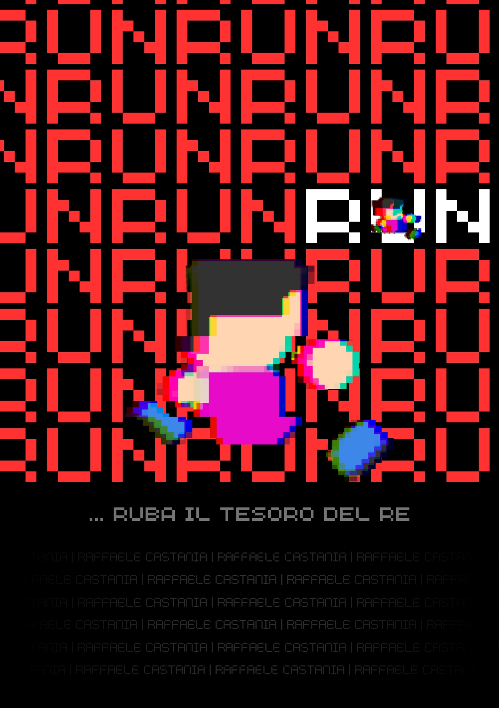
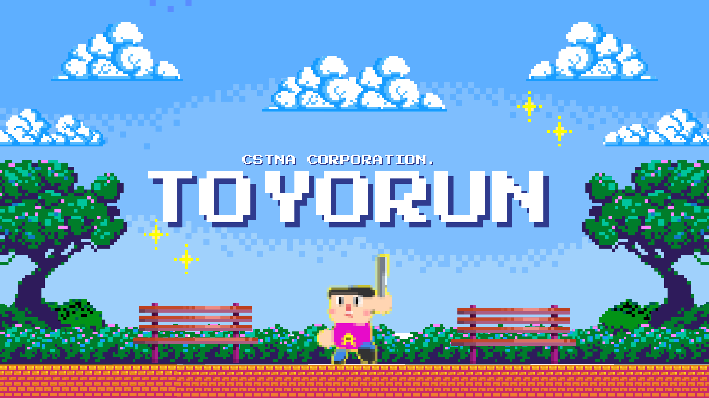
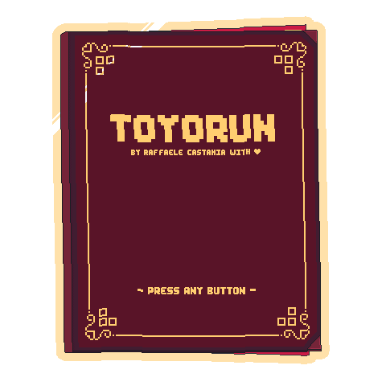

# Toyorun

# Index 
**For the GDD and other Game Design related docs see: "FileAggiuntivi"** 

- TODO

## Overview
The first complete game i made, this project was also an assignment from my academy!
This game features a simple **hack'n'slash** combat system, **bright colors** and some beautiful **voxel art**, all made by me!!!

## Objective
You must **fight enemies** until you reach the end!
**Kill those knights** and those **wizards**! 
Wait, wait, those wizards seem immortal! Or maybe you just need to throw some of their friendly knights at them!

## Mechanics in-depth
### Combat system
This game features a single combo chain, by pressing the attack button multiple times you will throw more powerful attacks! 
The combo has 3 different attacks, the last one is the strongest, so make sure to complete it.
While performing a combo you can dodge and grab, if you're fast enough you will not interrupt the combo chain, making you able to perform more actions whilst doing a combo.
### Dodge
With the dodge you can evade enemy attacks!
### Grab/Throw
_Those wizards are too strong i must find a way!
Why don't I just throw some knights at them? Wait, this works!_

Go near a knight press the button and now he's in your hands, position yourself and make him fly towards the wizard! You must be fast or else it will slip right through your fingers!

You must grab the enemies and throw them, in order to kill the wizards, there's no other way to damage them.

## Artstyle Overview
This game features a simple voxel art merged with low-poly models and elements in pixel art.
All lowpoly models (except the castle) and all voxel models are made by me!
Some pixel art elements were taken from itch.io paid bundles and modified to fit with the game artstyle.

## Programming Workflow

### Patterns Used
- **Singleton Patterns**: This were the essential to create centralized "managers" that contained all the code useful in every part of the program. 
  *Some of the files that used this pattern: **FileManager**, **GameManager**, **EnemyManager**, **Timers***

- **Finite State Machine:** Essential to create and manage player's and enemies behaviour.
  *Some of the files that used this pattern: FSMPlayerBehaviour, FSMMageEnemyBehaviour, FSMSimpleEnemyBehaviour*
### Posthumous Considerations
During the creation of this project i was still understanding the essential rules of code and project management.

**Code Management:**
I tried to keep track of all code by creating a huge flowchart, but later, i abandoned this workflow when the code became completely clear in my head.
In any case, as this was a rather complex project i learnt the importance of keeping track of all the code by using schemes.

**Project Managment:**
I also learnt to keep track of the project tasks by using a structured approach that subdivides everything in tasks a sub-tasks. In fact, actually, i am using Notion to keep track of every task, rule and useful information, inside my present ongoing projects.

**Excel tables for game design:**
Using excel tables was a thought that pierced me while trying to balance gameplay related data of in-game entities, but due to short deadlines i had to discard this thought that would've made the project more consistent and organized to save time.
